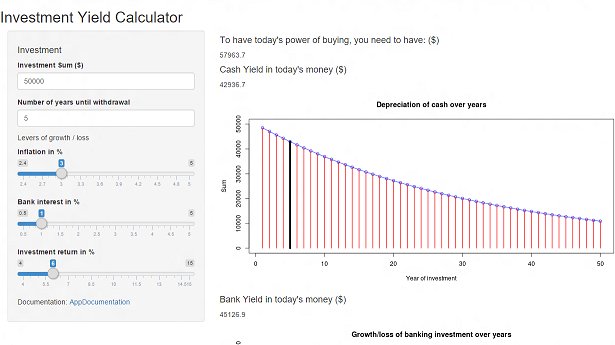

Investment Calculator
========================================================
author: Huy Dao
font-family: 'Calibri'
date: Sun Jun 21 12:30:53 2015

Why an Investment Calculator?
========================================================

It is always a challenge to decide what to do with your retirement money. Before investing though, you should have at least a basic idea of what would happen in different market scenarios.

The application aims to give everyone a simple view of their choices based on the market levers: inflation, bank rates and financial investments returns, as an incentive to actually go and discuss their choices with a professional. 

App View
========================================================
<small>App URL: https://ddpshinyurl.shinyapps.io/DevelopingDataProduct</small>

Cash Value over Years
========================================================
left: 30%

<small>For people who plan to downsize their expenses and want to know if they will have enough money for their projected expenses, the application shows how much their money value will be over the years and the need for extra financial resources to sustain the buying power their money has today. </small>

***
<small>To have today's power of buying, you need to have: \($\) 57963.7 </small>

<small>Cash Yield in 5 year at 2.4% inflation: \($\)42936.7</small>
 

Bank or Market Investment?
========================================================
<small>Bank Yield at 2.4% inflation and 1.5% bank interest in 5 years: \($\)45125.9</small>
 
***
<small>Investment Yield at 2.4% inflation and 6.5% investment return in 5 years: \($\)57458.99</small>
 
